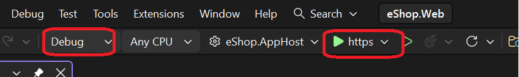
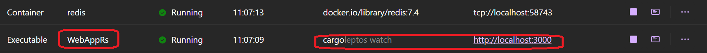
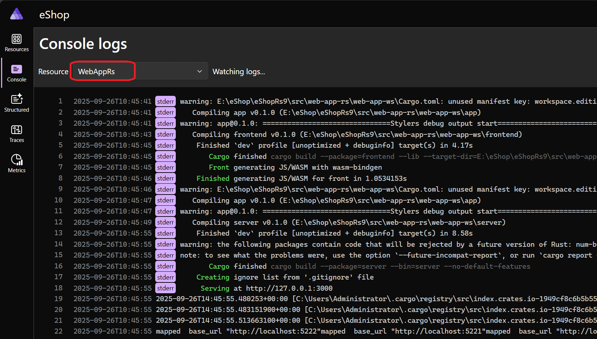

## WebApp  with Rust (Leptos) .

### Prerequisites
 - see original readme [Original Readme](./README_original.md) 
 - Rust toolchain
 - [`Leptos`](https://github.com/leptos-rs/leptos) 
 - [`cargo-leptos`](https://github.com/leptos-rs/cargo-leptos)
 - [`Protocol Buffers`](https://github.com/protocolbuffers)

  
     
## Aspire integration (sort of)
  

 
  
  
 
  
  
 

 
 
